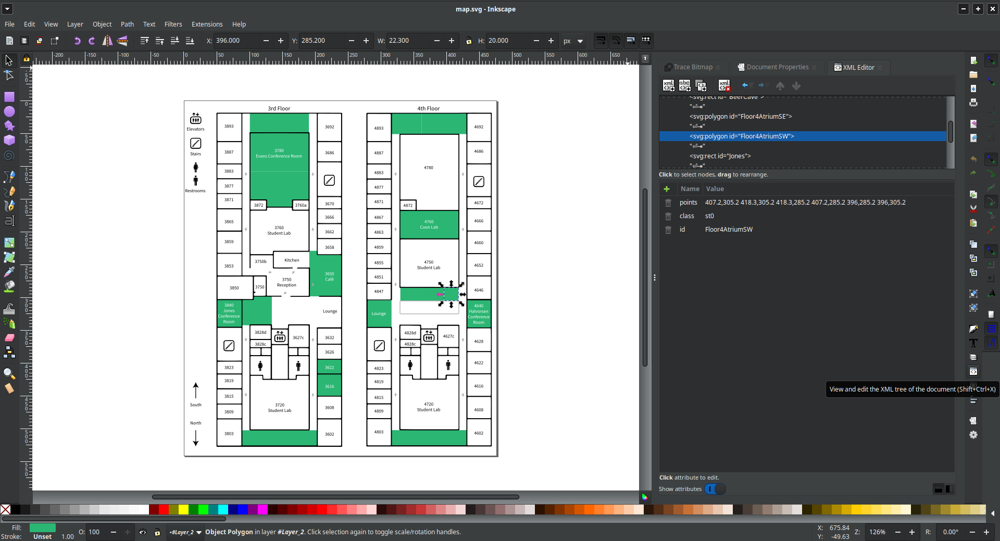

[Interactive map](https://alex-r-bigelow.github.io/scix-map/) for in-house SCI events

## Updating the map

The Area column of `allTitles.csv` corresponds to `id` attributes in `map.svg`.

To edit map areas, open `map.svg` in [Inkscape](https://inkscape.org/). All the interactive elements should be kept inside the `InteractiveLayer` Layer, and you can use Inkscape's XML view to add / edit `ids`:



Additionally, if you add or change Track values in `allTitles.csv`, make sure to update `colorMap` in `script.js`

## Local setup

```bash
# Install NVM, node.js
curl -o- https://raw.githubusercontent.com/nvm-sh/nvm/v0.39.7/install.sh | bash

nvm install node

# Clone the repository
git clone git@github.com:alex-r-bigelow/scix-map.git
cd scix-map

# Install and run the development server
npm install
npm run serve
```

## Public setup

To display the map on the touch table (or other display), open a browser and navigate to `https://alex-r-bigelow.github.io/scix-map`

Or, if you'd rather display a fork of this repository, make sure that Github Pages is using your `main` branch, and that the tiny url / QR code still point to the correct map!
